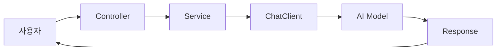

# Spring AI Study

Spring AI를 처음 배우면서 Day1, Day2, 그리고 `ch03-prompt` 자습 내용을 누적 정리한 학습 저장소입니다.

## 한눈에 보기

- Day1: Spring AI 첫 호출, `Controller -> Service -> ChatClient` 흐름 이해
- Day2: Prompt 설계, JSON/Object/List 형태의 Structured Output 실습
- 자습: `ch03-prompt` 프로젝트로 Prompt Template, Few-shot, Role Assignment 등 프롬프트 기법 분석
- 정리 자료: 학습 로그, 시각화 Markdown, 발표용 PPT

## 시각화 자료

- 발표용 PPT: [DAY1_DAY2_VISUAL.pptx](DAY1_DAY2_VISUAL.pptx)
- 학습 누적 로그: [STUDY_LOG.md](STUDY_LOG.md)

## 프로젝트 구성

| 폴더 | 내용 |
|---|---|
| `day01-chat-client` | Spring AI `ChatClient` 첫 호출, `/api/chat`, `/api/teacher`, HTML UI 실습 |
| `day02-prompt-output` | Prompt 설계, `record`, `entity()`, `List` 응답 실습 |
| `ch03-prompt` | Prompt Template, Zero-shot, Few-shot, Multi Messages 등 프롬프트 기법 자습 |

## 핵심 흐름



## Day1 요약

Day1의 목표는 AI를 Spring Boot 앱 안에서 처음 호출해보는 것이었습니다.

```java
return chatClient.prompt()
        .user(message)
        .call()
        .content();
```

이 코드는 AI에게 보낼 대화 묶음을 만들고, 사용자 질문을 넣고, 실제 호출한 뒤, 응답 본문만 꺼내는 흐름입니다.

## Day2 요약

Day2의 목표는 AI에게 원하는 방식으로 말 걸고 원하는 형태로 응답받는 것이었습니다.

| 기능 | 엔드포인트 | 응답 형태 |
|---|---|---|
| 요약 | `/api/summary` | `String` |
| 분류 | `/api/classify` | `String` |
| 분류 JSON | `/api/classify/json` | JSON 문자열 |
| 분류 객체 | `/api/classify/object` | `InquiryResult` |
| 영화 추천 | `/api/movie` | `List<MovieResponse>` |
| 준비물 추천 | `/api/packing` | `List<String>` |

## 오늘 자습 요약

`ch03-prompt`는 프롬프트 전략을 기능별로 나누어 실습하는 프로젝트입니다.

- `prompt-template`: 빈칸이 있는 프롬프트 틀에 값을 넣는 방식
- `multi-messages`: 이전 대화 내용을 기억하며 이어서 대화하는 방식
- `default-method`: `ChatClient.Builder`에 기본 시스템 메시지와 옵션을 미리 설정하는 방식
- `zero-shot-prompt`: 예시 없이 바로 작업을 시키는 방식
- `few-shot-prompt`: 예시를 보여준 뒤 같은 형식으로 답하게 하는 방식
- `role-assignment`: AI에게 특정 역할을 부여하는 방식
- `step-back-prompt`: 큰 질문을 작은 질문으로 나눠 단계적으로 답하는 방식
- `chain-of-thought`: 풀이 과정을 단계적으로 설명하게 하는 방식
- `self-consistency`: 여러 번 답을 받아 다수결로 안정성을 높이는 방식

## 학습 메모

지금까지 가장 중요한 문장은 이것입니다.

> Day1은 AI를 앱에 연결하는 날이고, Day2는 AI에게 원하는 방식으로 말 걸고 원하는 모양으로 응답받는 날입니다.
