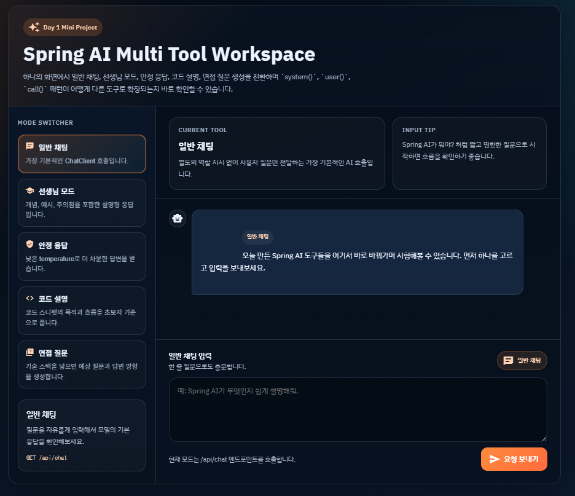

# Spring AI Day 1 - ChatClient Mini Tools

Spring AI `ChatClient`의 `.system()`, `.user()`, `.call()` 패턴을 사용해 만든 Day 1 미니 실습 프로젝트입니다.

## UI 구성 화면



## 실행 준비

Google GenAI API 키를 환경변수로 설정한 뒤 실행합니다.

```powershell
$env:GOOGLE_API_KEY="본인_API_KEY"
.\gradlew.bat bootRun
```

서버 기본 주소는 다음과 같습니다.

```text
http://localhost:8080
```

## 구현한 엔드포인트

### 1. 일반 채팅

```text
GET /api/chat?message=안녕
```

사용자 질문을 그대로 모델에 전달하고 일반 응답을 반환합니다.

### 2. 선생님 역할 응답

```text
GET /api/teacher?message=POJO가 뭐야?
```

Java, Spring Boot, Spring AI를 가르치는 선생님 역할의 system prompt를 적용합니다.

### 3. 코드 설명 도우미

```text
GET /api/code-explain?message=public class User { private String name; }
```

코드 스니펫을 입력하면 목적, 실행 흐름, 핵심 문법, 주의할 점을 초보자 기준으로 설명합니다.

### 4. 면접 질문 생성기

```text
GET /api/interview-questions?message=Java, Spring Boot, Spring AI
```

기술 스택을 입력하면 예상 면접 질문과 답변 방향을 생성합니다.

## 제출 체크리스트

- 코드 실행 확인
- 최소 2개 미니 엔드포인트 응답 캡처
- GitHub push 링크 제출

## 오늘 교육의 흐름
이 프로젝트는 한마디로 말씀드리면,
Spring Boot 안에서 Spring AI를 이용해 여러 AI 도구를 만들고, 그것을 하나의 웹 화면에서 선택해서 사용할 수 있게 만든 구조입니다.
전체 흐름은 다음과 같습니다.
서버 실행
→ AI 설정 로드
→ 사용자가 /chat 화면 접속
→ 화면에서 원하는 도구 선택
→ 메시지 입력 후 전송
→ 백엔드 API 호출
→ Spring AI가 Gemini에게 요청
→ 응답 생성
→ 화면에 결과 표시

1. 서버가 시작됩니다
가장 먼저 [Day01Application.java (line 1)](/C:/Users/금정산2-PC02/p2-spring/day01-chat-client/src/main/java/com/study/day01/Day01Application.java:1)가 실행됩니다.
이 파일은 Spring Boot 프로젝트의 시작점입니다.
@SpringBootApplication
public class Day01Application {
    public static void main(String[] args) {
        SpringApplication.run(Day01Application.class, args);
    }
}
여기서 SpringApplication.run(...)이 실행되면 서버가 켜지고,
Controller, Service 같은 Spring 객체들도 함께 등록됩니다.
즉 이 단계는 프로젝트 전체를 동작 가능한 상태로 올리는 시작 단계입니다.

2. AI 관련 설정을 읽어옵니다
그다음 [application.yaml (line 1)](/C:/Users/금정산2-PC02/p2-spring/day01-chat-client/src/main/resources/application.yaml:1)을 통해 AI 설정을 읽어옵니다.
여기에는 다음과 같은 정보가 들어 있습니다.
어떤 API 키를 사용할지
어떤 Gemini 모델을 사용할지
temperature, top-k 같은 기본 옵션을 어떻게 둘지
예를 들어:
api-key: ${GOOGLE_API_KEY}
model: gemini-3.1-flash-lite
temperature: 0.1
top-k: 1
즉 Spring AI는 이 설정을 바탕으로 “어떤 모델과 어떤 기본 성격으로 대화할지”를 정합니다.

3. 사용자는 /chat 화면으로 들어옵니다
사용자가 브라우저에서 /chat 주소로 접속하면
[ChaViewController.java (line 1)](/C:/Users/금정산2-PC02/p2-spring/day01-chat-client/src/main/java/com/study/day01/ChaViewController.java:1)가 이를 처리합니다.
@GetMapping("/chat")
public String chatview() {
    return "chat";
}
이 코드는 chat.html 화면을 열어달라는 뜻입니다.
즉 이 단계에서는 사용자가 AI 기능을 사용할 수 있는 웹 화면으로 진입하게 됩니다.

4. 화면에서 도구를 선택합니다
현재 [chat.html (line 1)](/C:/Users/금정산2-PC02/p2-spring/day01-chat-client/src/main/resources/templates/chat.html:1)은 통합 UI로 구성되어 있습니다.
이 화면 안에서 사용자는 다음 기능 중 하나를 선택할 수 있습니다.
일반 채팅
선생님 모드
안정 응답
코드 설명
면접 질문 생성
즉 지금은 단순 채팅창 하나가 아니라,
하나의 LLM을 여러 용도로 사용하는 멀티 툴 화면이 된 상태입니다.

5. 사용자가 메시지를 입력하고 전송합니다
사용자가 질문이나 코드, 기술 스택을 입력한 뒤 전송 버튼을 누르면
chat.html 안의 JavaScript가 동작합니다.
이 JavaScript는 현재 선택된 모드를 보고, 그에 맞는 API 주소를 결정합니다.
예를 들면:
일반 채팅
→ /api/chat

선생님 모드
→ /api/teacher

안정 응답
→ /api/safe-chat

코드 설명
→ /api/code-explain

면접 질문
→ /api/interview-questions
그리고 입력된 메시지를 URL 파라미터로 실어서 서버로 보냅니다.
const url = `${mode.endpoint}?message=${encodeURIComponent(message)}`;
const response = await fetch(url);
즉 이 단계는
프론트엔드가 사용자의 입력을 백엔드 API로 전달하는 단계입니다.

6. ChatController가 요청을 받습니다
이제 요청은 [ChatController.java (line 1)](/C:/Users/금정산2-PC02/p2-spring/day01-chat-client/src/main/java/com/study/day01/ChatController.java:1)로 들어갑니다.
예를 들어 /api/code-explain 요청은 다음 메서드가 받습니다.
@GetMapping("/api/code-explain")
public String codeExplain(@RequestParam String message) {
    return chatService.codeExplain(message);
}
이 클래스의 역할은 매우 분명합니다.
어떤 URL이 들어왔는지 확인하고
그 URL에 맞는 Service 메서드를 호출하는 것
즉 Controller는
**“주소와 기능을 연결하는 역할”**을 맡고 있습니다.

7. ChatService가 실제 AI 호출을 만듭니다
실제 핵심 로직은 [ChatService.java (line 1)](/C:/Users/금정산2-PC02/p2-spring/day01-chat-client/src/main/java/com/study/day01/ChatService.java:1)에 들어 있습니다.
이 클래스는 ChatClient를 사용해 Gemini에게 요청을 보냅니다.
기본 패턴은 다음과 같습니다.
chatClient.prompt()
        .system("역할 지시")
        .user("사용자 입력")
        .call()
        .content();
이 흐름을 말로 풀면 다음과 같습니다.
프롬프트를 시작합니다.
AI에게 어떤 역할로 답해야 하는지 알려줍니다.
사용자의 실제 입력을 전달합니다.
모델을 호출합니다.
응답 본문만 꺼냅니다.
예를 들어 teacher() 메서드는
“당신은 Java, Spring Boot, Spring AI를 가르치는 선생님입니다”라는 역할을 먼저 부여합니다.
codeExplain()은
“당신은 코드를 설명하는 선생님입니다”라는 역할을 줍니다.
interviewQuestions()는
“당신은 면접 코치입니다”라는 역할을 줍니다.
즉 이 프로젝트의 핵심은
같은 모델을 쓰더라도 system prompt를 다르게 주면 전혀 다른 도구처럼 동작하게 만들 수 있다는 점입니다.

8. Gemini가 응답을 생성합니다
Spring AI가 내부적으로 Gemini 모델을 호출하면,
Gemini가 그 역할과 사용자 입력을 바탕으로 답변을 만듭니다.
예를 들어:
일반 채팅이면 자연스러운 기본 응답
선생님 모드면 설명형 응답
코드 설명이면 코드 해설 응답
면접 질문이면 질문 목록과 답변 방향
이렇게 각 도구 성격에 맞는 결과가 만들어집니다.

9. 응답이 다시 화면으로 돌아옵니다
ChatService가 문자열 응답을 반환하면,
ChatController가 그것을 HTTP 응답으로 다시 브라우저에 돌려줍니다.
브라우저에서는 JavaScript가 이 결과를 받아서 채팅 영역에 붙입니다.
즉 사용자는 자신의 입력 아래에 AI의 응답이 붙는 형태로 결과를 보게 됩니다.
이 단계는 다음과 같이 정리할 수 있습니다.
AI 응답 생성
→ Service 반환
→ Controller 응답
→ 브라우저 수신
→ 화면 렌더링

10. 오늘 미니프로젝트의 본질
오늘 프로젝트는 단순히 “챗봇 하나 만들기”가 아닙니다.
핵심은 다음을 연습한 것입니다.
Spring AI ChatClient를 사용해서
system() + user() + call() 패턴으로
하나의 LLM을 여러 도구처럼 분리해서 사용하는 방법
즉 오늘 만든 기능들은 단순한 예제가 아니라,
앞으로 더 복잡한 AI 서비스로 확장될 수 있는 기본 구조입니다.
예를 들면:
문서 요약기
보고서 초안 생성기
FAQ 응답기
코드 리뷰 도우미
면접 코치
이런 것들을 모두 같은 방식으로 확장할 수 있습니다.
최종적으로 전체 흐름을 다시 한 번 짧게 정리드리면
Spring Boot 서버가 실행됩니다.
→ application.yaml에서 Gemini 설정을 읽습니다.
→ 사용자가 /chat 화면에 접속합니다.
→ 화면에서 원하는 도구를 선택합니다.
→ 메시지를 입력하고 전송합니다.
→ JavaScript가 알맞은 /api/... 주소를 호출합니다.
→ ChatController가 요청을 받습니다.
→ ChatService가 ChatClient로 Gemini를 호출합니다.
→ system prompt와 user prompt를 조합해 응답을 생성합니다.
→ 응답이 다시 브라우저로 돌아옵니다.
→ 화면에 결과가 표시됩니다.
그리고 역할을 한 줄씩 정리하면 이렇게 보시면 됩니다.
Day01Application
→ 서버 시작

application.yaml
→ AI 모델 설정

ChaViewController
→ /chat 화면 열기

chat.html
→ 사용자 입력, 모드 선택, API 호출

ChatController
→ URL과 기능 연결

ChatService
→ 실제 AI 프롬프트 설계와 모델 호출

Gemini
→ 최종 응답 생성
